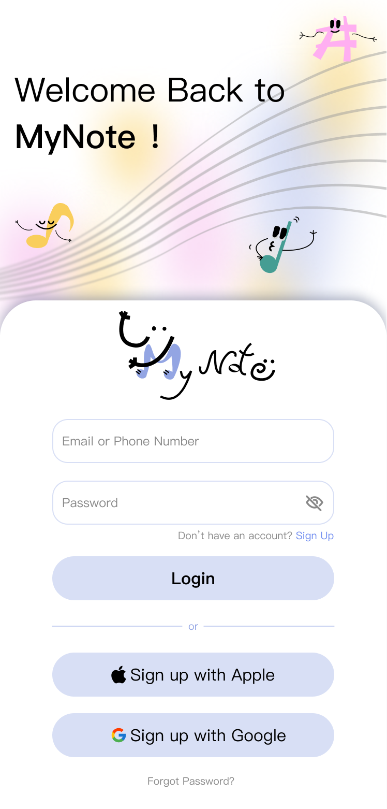
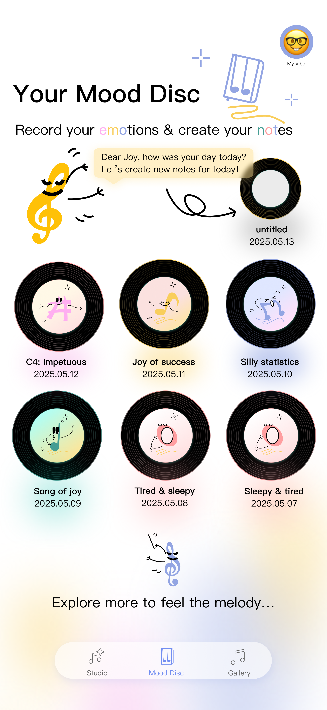
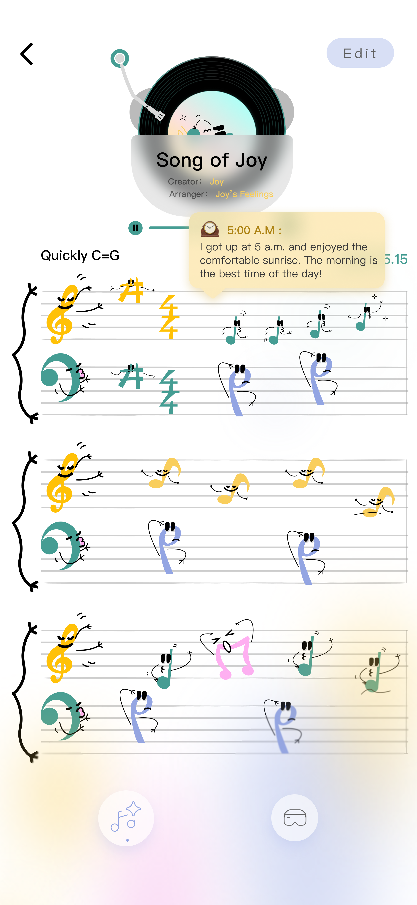

# 🎵 MyNote: AI-Driven Musical Emotion Diary


> **CS385FZ Final Project** > *A multimodal emotion regulation platform combining physiological data, AI therapy, and generative music.*

---

## 📱 Project Overview

**MyNote** is a cross-platform mobile application designed to help users visualize and regulate their emotions. By combining physiological data (HRV from Apple Watch) with textual analysis, MyNote transforms abstract feelings into tangible musical melodies.

**Key Features:**

* **❤️ Real-time Bio-Sync**: Syncs Heart Rate & HRV via **HealthKit** to detect stress levels.
* **💬 AI Healing Chat**: Context-aware therapy powered by **Deepseek LLM**.
* **🎼 Generative Music**: Converts daily emotions into custom audio tracks using **Suno AI**.
* **🕶️ Spatial Memory**: (Prototype) Visualizes emotional history in 3D using Vision Pro integration.

---

## 📸 Screenshots

|                 Login / Onboarding                  |                   Home Dashboard                   |                  AI Healing Chat                   |                     Music Player                     |
| :-------------------------------------------------: | :------------------------------------------------: | :------------------------------------------------: | :--------------------------------------------------: |
|  |  |  |  |

---

## ⚠️ Note to Examiners (Regarding Expo)

**Why React Native CLI?**
While the course recommends Expo, this project requires **advanced native module linking** that exceeds the capabilities of the standard Expo Go client. Specifically:

1.  **`react-native-health`**: Required to access Apple HealthKit for HRV/Step data.
2.  **`react-native-watch-connectivity`**: Required for real-time bi-directional communication with the Watch App.

Therefore, we adopted the **React Native CLI** workflow to ensure full native functionality. Please follow the "Installation" guide below to run the project.

---

## 🛠️ Tech Stack

### Frontend (Mobile)

* **Framework**: React Native CLI (v0.76)
* **Language**: TypeScript
* **Navigation**: React Navigation v7 (Stack + Bottom Tabs)
* **State Management**: React Context API (`AuthContext`)
* **Audio**: `react-native-sound` (Streaming playback)

### Backend (API)

* **Framework**: FastAPI (Python 3.10)
* **Concurrency**: Async/Await architecture for non-blocking AI tasks.
* **Database**: SQLite (Dev) / PostgreSQL (Prod) via SQLAlchemy.

### AI Services

* **Deepseek-V3**: Semantic analysis & emotional reasoning.
* **Suno AI**: Text-to-Audio generation.

---

## 🚀 Installation & Running

### Prerequisites

* Node.js > 18
* Python > 3.10
* CocoaPods (for iOS)
* Xcode (Mac only, for iOS simulator)

### 1. Backend Setup (FastAPI)

```bash
# Navigate to backend directory
cd MynoteBack

# Create virtual environment
python -m venv venv
source venv/bin/activate  # Windows: venv\Scripts\activate

# Install dependencies
pip install -r requirements.txt

# Run the server
uvicorn main:app --reload --host 0.0.0.0 --port 8000

```

### 2. Frontend Setup (React Native)

```bash
# Navigate to frontend directory
cd Mynote_RN

# Install dependencies
npm install

# Install iOS Pods (CRITICAL STEP)
cd ios && pod install && cd ..

# Run on iOS Simulator
npm run ios
# Or for Android
npm run android

```

---

## 📂 Project Structure

```text
Mynote_RN/
├── src/
│   ├── navigation/      # RootStack, AuthStack, MainTab (React Nav v7)
│   ├── screens/         # UI Screens (Studio, Home, Profile)
│   ├── components/      # Reusable UI components
│   ├── services/        # API, HealthService, WatchService
│   ├── store/           # AuthContext & Global State
│   └── hooks/           # Custom Logic (useStudioChat)
├── ios/                 # Native iOS code & Pods
└── android/             # Native Android code

MynoteBack/
├── routers/             # API Endpoints (music.py, ai.py)
├── services/            # Business Logic (Deepseek, Suno wrappers)
├── models/              # SQLAlchemy Database Models
└── main.py              # Application Entry Point

```

---

## 🧪 Testing

We have implemented a rigorous testing strategy:

* **Auth Persistence**: Tested killing the app; user session remains active.
* **Async Polling**: Verified `useStudioChat` correctly polls the backend for music generation status.
* **HealthKit Permissions**: Verified permission request flow on physical devices.

---

## 👥 Authors

* **LiJiaLiang** - *Lead Developer & AI Integration & Backend & Database*
* **WangYiYu & ZhouZheRu** - *UI/UX Design*

