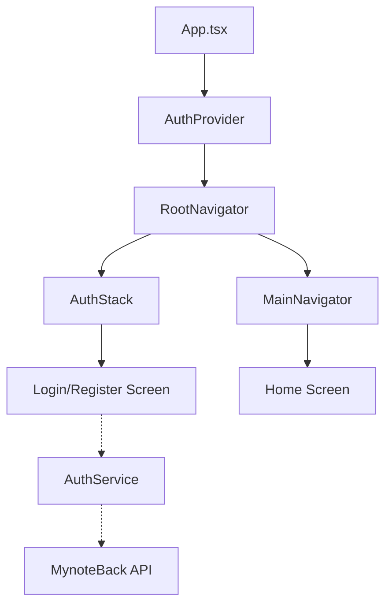

# Phase 2: Project Setup & Foundation Report

## Overview
This phase focused on establishing the development environment, verifying dependencies, and creating the core application structure for `Mynote_RN` and `MynoteBack`.

## Completed Tasks

### Frontend (`Mynote_RN`)
-   **Environment**: Confirmed usage of React Native CLI.
-   **Navigation**:
    -   Integrated `React Navigation v6`.
    -   Implemented `RootNavigator` with Auth (Stack) and Main (Tab/Stack) flows.
    -   Created type definitions in `src/navigation/types.ts`.
-   **State Management**:
    -   Created `AuthContext` (`src/store/AuthContext.tsx`) to manage user session.
    -   Wrapped application root with `AuthProvider`.
-   **Service Layer**:
    -   Configured `axios` in `src/services/api.ts` with base URL handling for Android/iOS.

### Backend (`MynoteBack`)
-   **Environment**:
    -   Successfully initialized Python Virtual Environment (`.venv`) using **Python 3.13**.
    -   Installed all dependencies from `requirements.txt`.
    -   **Verification**: Server started successfully on port 8000. Health check (`/ping`) returned `{"message":"pong"}`.

## Architecture Diagram

## Next Steps
1.  Resolve Backend Python version compatibility.
2.  Start **Phase 3: Feature Migration**, beginning with the **Launch** and **Auth** screens as they define the entry point.
